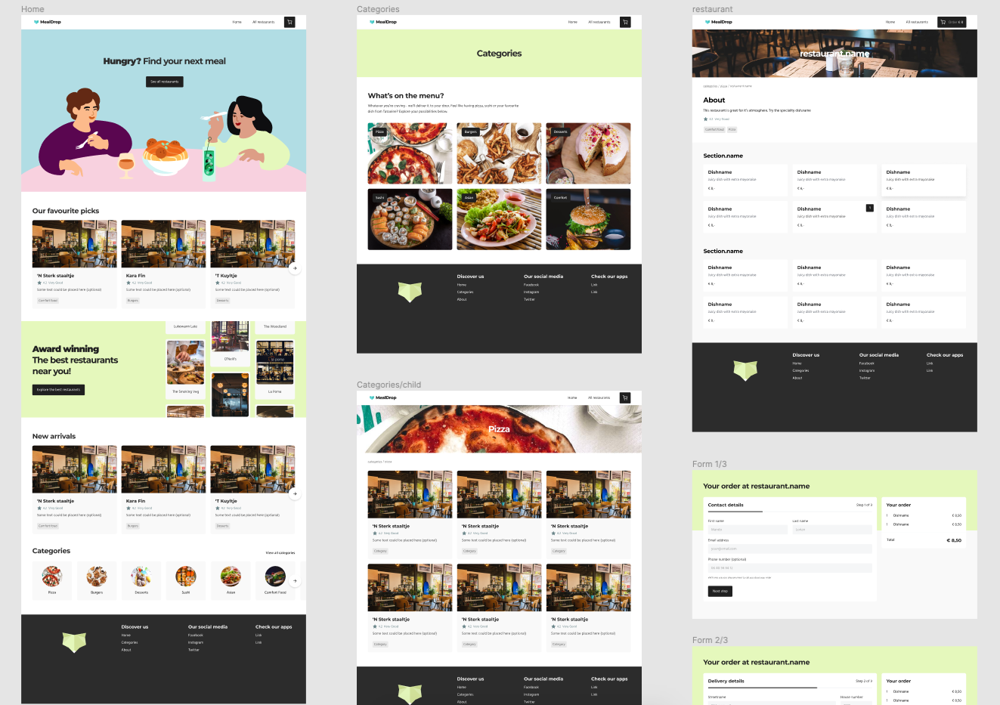

## Mealdrop

Mealdrop is a reproduction of a real-world application to serve as an example for all the cool things you can do with Storybook!

[App demo](http://mealdrop.netlify.com/)

[Storybook demo](http://mealdrop.netlify.com/storybook)

## Available Scripts

In the project directory, you can run:

### `yarn start`

Runs the app in the development mode. 
Open [http://localhost:3000](http://localhost:3000) to view it in the browser.

The page will reload if you make edits. 
You will also see any lint errors in the console.

### `yarn test`

Launches the test runner in the interactive watch mode. 
See the section about [running tests](https://facebook.github.io/create-react-app/docs/running-tests) for more information.

### `yarn storybook`

Launches Storybook on port 6006.