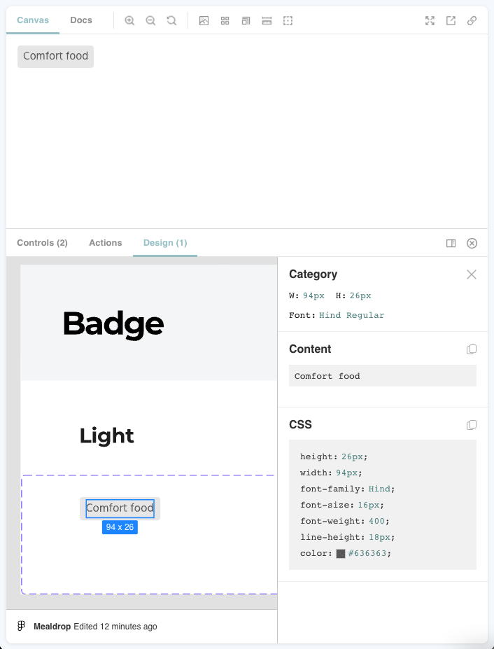
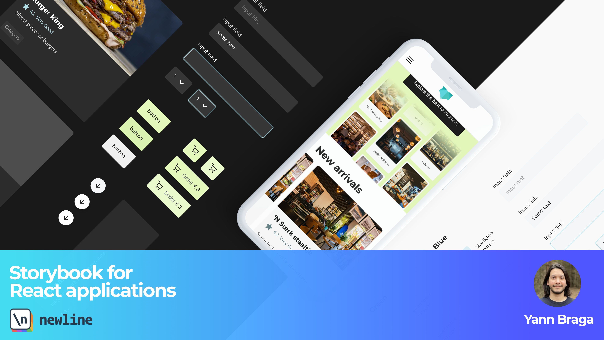

## MealDrop

Storybook is an open-source tool that helps you develop UI components in isolation. It runs in your codebase, but separately from your application. It's like a sandbox, allowing you to not get distracted by incomplete APIs, flaky data, and other external dependencies. It integrates with frameworks like React, Vue, Svelte, Angular, and many others!

With Storybook, you can ease the development of a design system and share a common language with Designers. QA's can get an overview and test functionalities in isolation. Stakeholders can use it for demo purposes. Overall, Storybook helps connect all of these people, greatly improving collaboration!

This is MealDrop, a real-world like project from the [Storybook for React apps](https://www.newline.co/courses/storybook-for-react-apps) course, used as an example to teach you how to unleash the full potential of Storybook for React apps. It's a food delivery app built from scratch with:

- Modern React with [Typescript](https://www.typescriptlang.org/) and hooks
- Styles with [Styled components](http://styled-components.com/)
- State management [Redux](https://redux.js.org/) with [@reduxjs/toolkit](https://redux-toolkit.js.org/)
- Tests with [React Testing Library](https://testing-library.com/docs/react-testing-library/intro/)
- Routing with [React router](https://reactrouter.com/)
- Component explorer [Storybook](https://storybook.js.org/)

Every component of the app is in Storybook, and the designs are all in Figma.

## What you will learn

- The core concepts of Storybook
- Development workflow with Storybook
- Unleash the full potential of Storybook, adding components, features and pages
- Testing strategies with Storybook
- How to build UI faster
- Mental models for component development
- Tools to improve designer-developer collaboration
- Best practices

We start from the basics of Storybook, and later switch to MealDrop, a real world application, learning how to develop features directly in Storybook, saving lots of development time, and at the same time creating a living documentation of components and features. You will see the power of addons and how they help improve the development experience and the end quality of components.

You will learn how to connect Figma to Storybook:

You will learn how to add styled components support and create a tool to switch color themes in Storybook:

You will add full pages to Storybook and write interaction tests that run directly in the browser:

And you will learn how to automate interactions tests with Jest and Playwright, add visual regression tests, test accessibility, and much more!

By the end of the course, you'll be able to impress your team by implementing a tool which will drastically improve the development workflow and collaboration of your projects!

If you're interested in the [course](https://www.newline.co/courses/storybook-for-react-apps) (with a free module!), click on the image below to access it:

