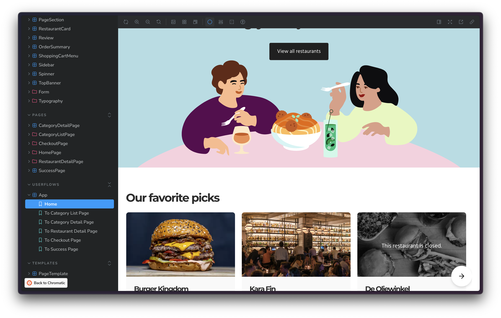

## Chromatic demo with MealDrop

This Storybook is based on the [Mealdrop app](https://github.com/yannbf/mealdrop), a project used in the [Storybook for React apps](https://www.newline.co/courses/storybook-for-react-apps) course by [Yann Braga](https://twitter.com/yannbf).

## To run the project locally

1. Clone the project
2. Run `yarn` to install the dependencies
3. Run `yarn storybook` to start the Storybook server
4. Or run `yarn start` to start the app

### To run Chromatic tests

```bash
$ CHROMATIC_PROJECT_TOKEN=<your_project_token> yarn chromatic
```

---

## What the demo showcases

- [Deployed Storybook](https://main--665a454c207e6c8e7fea1174.chromatic.com/)
- [Deployed Mealdrop app](https://mealdrop.vercel.app/)
- [Figma file](https://www.figma.com/design/JHymAhlkm3qUEjy360dL8k/Mealdrop-for-demo?node-id=1091-2985&m=dev)

### Visual tests

This project is configured to demonstrate all three Chromatic integrations:

- [Storybook](https://www.chromatic.com/docs/storybook/): all `*.stories.js` files will be tested by Chromatic
- [Playwright](https://www.chromatic.com/docs/playwright/): `tests/example.spec.ts` E2E test
- [Cypress](https://www.chromatic.com/docs/cypress/): `cypress/e2e/spec.cy.js` E2E test

### Diffing basics

[This build](https://www.chromatic.com/build?appId=665a454c207e6c8e7fea1174&number=12) has UI changes that can be reviewed in the Chromatic UI. You can see component level changes and see how those bubble up to the page level.


### Testing variants with Modes

#### Viewports

The [Header component](https://main--665a454c207e6c8e7fea1174.chromatic.com/?path=/story/components-header--default) is a good example of using the viewports addon to test responsiveness.


#### Themes

The Mealdrop Storybook is configured with a theme switcher that toggles between light and dark themes. This is useful for testing components in with different themes during development. For example, open the [RestaurantCard](https://main--665a454c207e6c8e7fea1174.chromatic.com/?path=/story/components-restaurantcard--default) story and toggle the theme switcher.

<video src="https://github.com/chromaui-demo/mealdrop-demo/assets/42671/ce671c7a-fe43-4b82-a4b9-df32de166f45"></video>

Theme (and other such variants) plug into Chromatic's [Modes feature](https://www.chromatic.com/docs/modes/) to capture snapshots of different variants of a component.


### Mocking API requests and interactions

[Home component](https://main--665a454c207e6c8e7fea1174.chromatic.com/?path=/story/userflows-app--home) is a basic example of a story that mocks API data, in this case the restaurants data, using the [Storybook MSW addon](https://storybook.js.org/docs/writing-stories/mocking-network-requests#set-up-the-msw-addon).



[RestaurantDetailPage](https://main--665a454c207e6c8e7fea1174.chromatic.com/?path=/story/pages-restaurantdetailpage--with-modal-open) is an example of a full page story that also that uses mocked API requests and has [interaction tests](https://www.chromatic.com/docs/interactions/).


[App » ToCheckoutPage](https://main--665a454c207e6c8e7fea1174.chromatic.com/?path=/story/userflows-app--to-checkout-page) is another full page example with complex (multi-page) interactions and mocked API requests


### Figma integration

There are three workflows:

1. Figma designs can be embedded within Storybook to provide context for developers, eg: [RestaurantCard story in published Storybook](https://main--665a454c207e6c8e7fea1174.chromatic.com/?path=/story/components-restaurantcard--default)
   

2. Storybook Connect plugin enables designers to view Storybook stories within Figma, eg: [RestaurantCard Figma component](https://www.figma.com/design/JHymAhlkm3qUEjy360dL8k/Mealdrop-for-demo?node-id=1091-2985&m=dev)
   <video src="https://github.com/chromaui-demo/mealdrop-demo/assets/42671/4664a74f-efd9-4a75-8454-0a82276bb5a8"></video>

3. Figma designs in Chromatic: in Chromatic's library view you can view Figma designs alongside Storybook stories and snapshots captured by Chromatic, eg: [RestaurantCard](https://www.chromatic.com/component?appId=665a454c207e6c8e7fea1174&csfId=components-restaurantcard--default&buildNumber=5&k=665dff72d4b0e5916b350a46-dark-designs-true&h=43&b=-6)
   <video src="https://github.com/chromaui-demo/mealdrop-demo/assets/42671/63bb41f5-a53b-4e85-a18b-42e6d57f0bd7"></video>
